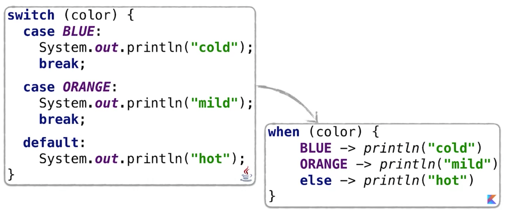
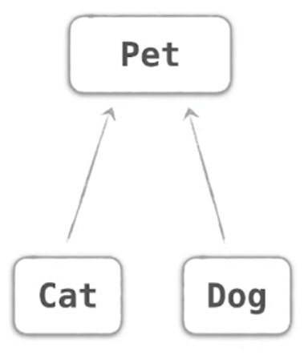

# Kontrollstrukturen in Kotlin
Dieses Kapitel widmet sich den Basiskontrollstrukturen in Kotlin:
- Verzweigungen (if / else und when)
- Schleifen
- in checks und ranges

## Verzweigungen (if / else / when)
In Kotlin gibt es keinen ternären Operator, wie in Java.
```java
(a > b) ? a : b
```
Für diese Zwecke können wir einfach eine ```if ... else ...``` Verzweigung verwenden:

```kotlin
val max = if (a > b) a else b
```

Das Schlüsselwort ```when``` können wir entsprechend einer ```switch```-Anweisung aus Java verwenden:

```kotlin
enum class Color {
    BLUE, ORANGE, RED
}
fun getDescription(color: Color): String =
    when (color) {
        BLUE -> "cold"
        ORANGE -> "mild"
        RED -> "hot"
    }
```

**Vergleich von Java ```switch``` und ```when``` in Kotlin:**



Um die enmus in diesem Beispiel direkt verwenden zu können, müssen wir diese importieren:

```kotlin
package mypackage
import mypackage.Color.*
enum class Color {
    BLUE, ORANGE, RED
}
fun .....
    ....
```

Um mehrere Werte für einen "Case" zu verwenden, können wir diese mit Komma getrennt anführen:

```kotlin
fun respondToInput(input: String) = when (input) {
    "y", "yes" -> "I'm glad you agree!"
    "n", "no" -> "I am sorry to hear, you disagree!"
    else -> "I do not understand your arguments!"
}
```

Als Bedingungen für einen Zweig können wir beliebige Statements - nicht nur Konstante - verwenden:

```Kotlin
fun mix(c1: Color, c2: Color) =
    when (setOf<Color>(c1, c2)) {
        setOf(RED, YELLOW) -> ORANGE
        setOf(YELLOW, BLUE) -> GREEN
        setOf(BLUE, VIOLET) -> INDIGO
        else -> throw Exception("Dirty Color")
    }
```

Mit ```when``` kann auch der Subtyp eines Objekts überprüft werden:



```kotlin
// In Kotlin
when (pet) {
    is Cat -> pet.meow()
    is Dog -> pet.woof()
}
```

Mit dem Schlüsselwort ```is``` können wir auf den Typ eines Objekts überprüfen. Im Unterschied zu Java ist kein expliziter Cast auf den Subtyp erfordlich, da dieser Cast durch Kotlin _smart-cast_ automatisch durchgeführt wird.

Zum Vergleich, der erforderliche Code in Java:

```java
// In Java:
if (pet instanceof Cat) {
    ((Cat) pet).meow()
} else if (pet instanceof Dog) {
    ((Dog) pet).woof()
}
```

Seit der Version 1.3 können wir innerhalb eines _when_-Konstrukts auch direkt eine neue Variable deklarieren:

```kotlin
when (val pet = getMyFavouritePet()) {
    is Cat -> pet.meow()
    is Dog -> pet.woof()
}
```

Das ```when```-Konstrukt ist vor allem eine starke Vereinfachung für Mehrfachverzweigungen. Natürlich kann ```when``` auch für eine einfache Verzweigung verwendet werden. Hier eignet sich jedoch das _Standard_ "if - else" genauso gut.
